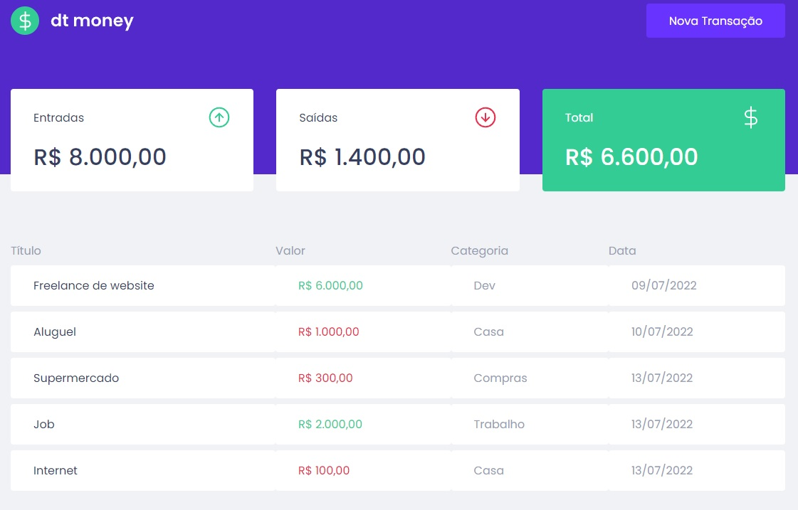
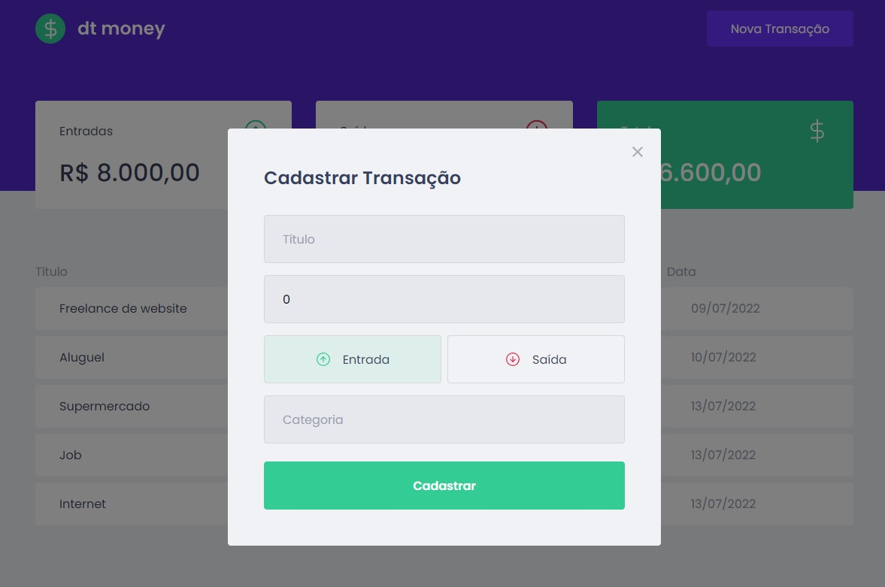

<h1 align="center">
 
 
 
 
Dt Money
</h1>

  
  

## About Dt Money
This website was designed to help keep track of your finances.
The website receive the data of your Transactions, they can be deposits or withdraws, and the details of those, the title of the Transactions, the category and the date as well. And calculates the totals.

## Components
- **React Js ⚛️**
- **TypeScript ✏️**
- **Javascript ⚛️**
- **HTML 📂**
- **CSS 📂**

## Getting started
1. Open terminal on src folder  
2. Run <code>npm install</code> to install node dependencies  
3. Run server with <code>yarn start</code>
